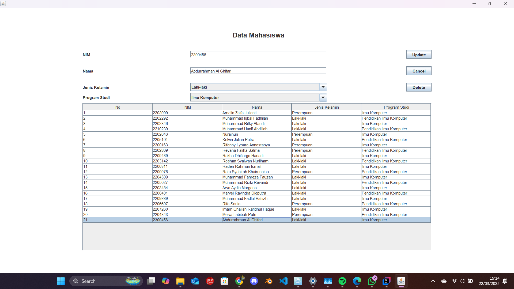
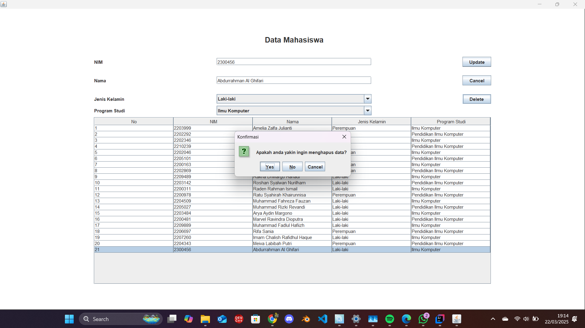
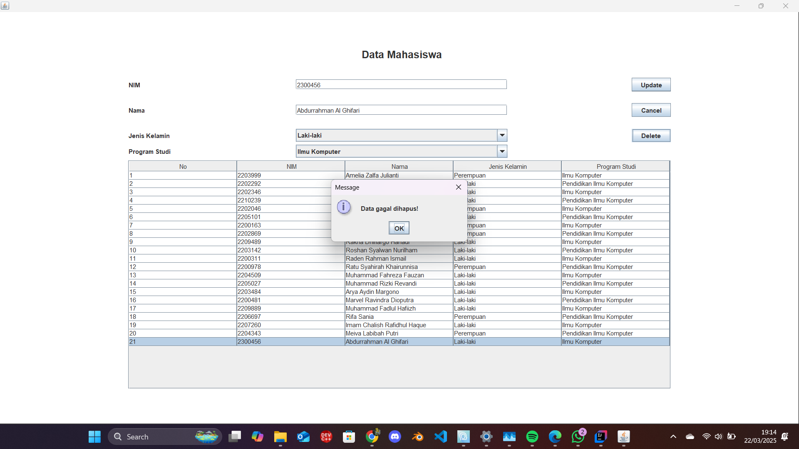

# TP3DPBO2025C2

## Janji
Saya Abdurrahman Al Ghifari mengerjakan evaluasi Tugas Praktikum dalam mata kuliah
Desain Pemrograman Berbasis Object untuk keberkahanNya maka saya tidak melakukan kecurangan
seperti yang telah dispesifikasikan. Aamiin.

## Desain Program
Project ini merupakan aplikasi sederhana untuk mengelola data mahasiswa menggunakan konsep Object-Oriented Programming (OOP) dan antarmuka grafis (GUI) berbasis Java Swing. Program ini mengintegrasikan beberapa konsep OOP, antara lain:

### 1. Kelas Mahasiswa
- **Fungsi:**  
  Menjadi model data untuk menyimpan informasi mahasiswa.

- **Atribut:**
    - `nim` : Nomor Induk Mahasiswa.
    - `nama` : Nama mahasiswa.
    - `jenisKelamin` : Jenis kelamin mahasiswa.
    - `prodi` : Program studi yang diambil.

- **Metode:**  
  Terdapat getter dan setter untuk setiap atribut, memungkinkan enkapsulasi data.

### 2. Kelas Menu (GUI)
- **Fungsi:**  
  Menyediakan antarmuka pengguna untuk melakukan operasi CRUD (Create, Read, Update, Delete) terhadap data mahasiswa.

- **Komponen Utama:**
    - **Form Input:**
        - *TextField*: Untuk memasukkan NIM dan Nama.
        - *ComboBox*: Untuk memilih Jenis Kelamin dan Program Studi.

    - **Tabel Mahasiswa:**  
      Menampilkan daftar mahasiswa secara dinamis menggunakan `DefaultTableModel` yang di-update setiap kali terjadi perubahan data.

    - **Tombol Aksi:**
        - **Add/Update:** Untuk menambahkan data baru atau mengupdate data yang sudah ada.
        - **Delete:** Untuk menghapus data. Tombol ini hanya terlihat ketika ada baris yang dipilih pada tabel.
        - **Cancel:** Untuk mengosongkan form dan mengembalikan tampilan ke kondisi awal.

- **Logika Program:**
    - **Penyimpanan Data:**  
      Data mahasiswa disimpan dalam sebuah `ArrayList<Mahasiswa>`.

    - **Interaksi Tabel dan Form:**  
      Saat pengguna mengklik sebuah baris pada tabel, data dari baris tersebut ditampilkan pada form input. Hal ini memungkinkan pengguna untuk mengupdate atau menghapus data yang telah ada.

    - **Konfirmasi Penghapusan:**  
      Ketika tombol delete ditekan, muncul dialog konfirmasi menggunakan `JOptionPane.showConfirmDialog`. Data hanya akan dihapus jika pengguna memilih opsi **Yes**; jika memilih **No** atau **Cancel**, operasi penghapusan dibatalkan.

## Alur Program
1. **Inisialisasi dan Populasi Data:**
    - Pada awal program, objek-objek GUI diinisialisasi dan data awal mahasiswa dipopulasi ke dalam `ArrayList` melalui metode `populateList()`.
    - Tabel mahasiswa diisi dengan data dari list menggunakan metode `setTable()`.

2. **Input Data Mahasiswa:**
    - Pengguna mengisi form input (NIM, Nama, Jenis Kelamin, dan Program Studi).
    - Menekan tombol **Add** akan memanggil metode `insertData()`, yang:
        - Mengambil data dari form,
        - Menambahkan objek `Mahasiswa` baru ke dalam list,
        - Meng-update tampilan tabel, dan
        - Mengosongkan form input untuk persiapan data berikutnya.

3. **Pemilihan Data untuk Update atau Delete:**
    - Pengguna dapat memilih salah satu baris pada tabel.
    - Data dari baris yang dipilih ditampilkan ke form input.
    - Tombol **Add** berubah menjadi **Update**, dan tombol **Delete** menjadi terlihat, memberikan opsi untuk memodifikasi atau menghapus data.

4. **Update Data Mahasiswa:**
    - Jika data diubah di form dan tombol **Update** ditekan, metode `updateData()` dipanggil.
    - Metode ini memperbarui data di list berdasarkan index baris yang dipilih dan memperbarui tabel.

5. **Hapus Data Mahasiswa:**
    - Menekan tombol **Delete** akan menampilkan dialog konfirmasi menggunakan `JOptionPane.showConfirmDialog`.
    - Jika pengguna memilih **Yes**, data dihapus dari list dan tabel diperbarui.
    - Jika memilih **No** atau **Cancel**, operasi penghapusan dibatalkan dan data tetap tersimpan.

6. **Pembatalan Input:**
    - Tombol **Cancel** mengosongkan form input dan mengembalikan tampilan tombol ke kondisi awal (tombol Add dan menyembunyikan tombol Delete), sehingga tidak ada baris yang aktif atau terpilih.

## Dokumentasi Program Java Frame

- **Form Input dan Tabel Mahasiswa:**  
  Menampilkan form untuk input data dan tabel untuk menampilkan daftar mahasiswa yang telah dimasukkan.

- **Dialog Konfirmasi:**  
  Saat penghapusan data, aplikasi menampilkan dialog konfirmasi untuk memastikan bahwa pengguna benar-benar ingin menghapus data yang dipilih.

